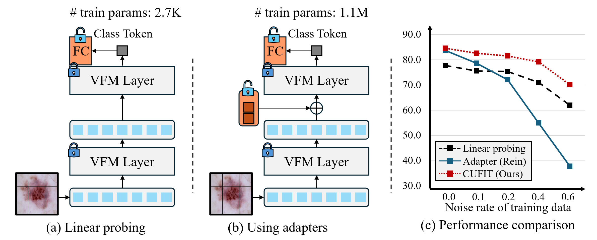

<p align="center">
   
   <h2 align="center">Curriculum Fine-tuning of Vision Foundation Model for Medical Image Classification Under Label Noise</h2>
   <p align="center">
      <a href="https://scholar.google.com/citations?user=Ctm3p8wAAAAJ&hl=en"><strong>Yeonguk Yu</strong></a>
      ·
      <a><strong>Minhwan Ko</strong></a>
      ·
      <a href="https://scholar.google.com/citations?user=-O_DjyEAAAAJ&hl=en"><strong>Sungho Shin</strong></a>
      ·
      <a"><strong>Kangmin Kim</strong></a>
      ·
      <a href="https://scholar.google.com/citations?user=QVihy5MAAAAJ&hl=en"><strong>Kyoobin Lee</strong></a>
     <br>
     <a href="https://sites.google.com/view/gistailab/"><strong>Artificial Intelligence LAB</strong></a>
      GIST, South Korea
   </p>
   <h3 align="center">NeurIPS 2024 - Poster Presentation</h3>
</p>

<p align="center">
   <a href=''>
      
   </a>

   <a href="">
      
   </a>
</p>


Our **CU**rriculum **FI**ne-**T**uning of Vision Foundation Model **(CUFIT)** offers a robust training framework for medical multi-class image classification under noisy label conditions. 
Leveraging vision foundation models (VFMs) pretrained on large-scale datasets, CUFIT effectively handles noisy labels without modifying the feature extractor, using linear probing. Subsequently, it employs a curriculum fine-tuning approach, beginning with linear probing to ensure robustness to noisy samples, followed by fine-tuning two adapters for enhanced classification performance. CUFIT outperforms conventional methods across various medical image benchmarks, achieving superior results at various noise rates on datasets such as HAM10000 and APTOS-2019, highlighting its capability to address the challenges posed by noisy labels in medical datasets.

<br/><br/>
<p align="center">
  
</p>

**TL;DR**: We propose CUFIT, a robust fine-tuning method for vision foundation models under noisy label conditions, based on the advantages of linear probing and adapters.

## 🚀 Getting Started
### Clone the Repository
   ```bash
   git clone https://github.com/gist-ailab/CUFIT.git
   cd CUFIT
   ```

### Environment Setup
   This code is tested under Linux 20.04 and Python 3.8.18 environment, and the code requires following main packages to be installed:
    
   - [Pytorch](https://pytorch.org/): Tested under 2.0.1 version of Pytorch-GPU.
   - [torchvision](https://pytorch.org/vision/stable/index.html): which will be installed along Pytorch. Tested under 0.15.2 version.
   - [MedMNIST](https://medmnist.com/): which is needed for experiments with BloodMnist, OrgancMnist. Tested under 3.0.1 version.

you may use the follwoing lines.
```bash
conda env create -n cufit python=3.8
conda activate cufit
pip install -r requirement.txt
```


### Dataset Preparation
   Some public datasets are required to be downloaded for running evaluation.   
   - [HAM10000](https://challenge.isic-archive.com/data/#2018)
   - [APTOS-2019](https://www.kaggle.com/c/aptos2019-blindness-detection/data)

### Config file may need to be changed for your path to download. For example,
~~~
# conf/ham10000.json
{
    "epoch" : "100",
    "id_dataset" : "./data/ham10000",   # Your path to dataset
    "batch_size" : 32,
    "save_path" : "./checkpoint/ham10000",   # Your path to checkpoint
    "num_classes" : 7
}
~~~


Place the data and create checkpoint folder following this directory structure:
   ```plaintext
   CUFIT/
   ├── assets/
   ├── checkpoints/
   │   └── HAM10000/
   │   └── APTOS-2019/
   ├── conf/
   │   └── HAM10000.json
   |   └── aptos2019.json
   ├── data/
   |   ├── HAM10000/
          ├── test/
          └── train/
   |   └── APTOS-2019
          ├── test_images/
          ├── train_images/
          ├── val_images/
          ├── test.csv
          ├── train_1.csv
          └── valid.csv
   └── rein/
   └── utils/
   ```

---
## How to Run
### To train a model by linear probing with DINOv2-small architecture
~~~
python train_linear.py -d 'data_name' -g 'gpu-num' -n 'noise_rate' -s 'save_name'
~~~
for example,
~~~
python train_linear.py -d ham10000 -g 0 -n 0.2 -s dinov2s_linear_0.2
~~~

### To train a model by a single rein adapter with DINOv2-small architecture
~~~
python train_rein.py -d 'data_name' -g 'gpu-num' -n 'noise_rate -s 'save_name'
~~~
for example,
~~~
python train_rein.py -d ham10000 -g 0 -n 0.2 -s dinov2s_single_rein_0.2
~~~


### To train a model by CUFIT with DINOv2-small architecture
~~~
python train_rein_ours_three_head.py -d 'data_name' -g 'gpu-num' -n 'noise_rate -s 'save_name'
~~~
for example, 
~~~
python train_rein_ours_three_head.py -d ham10000 -g 0 -n 0.2 -s dinov2s_cufit_0.2
~~~

    
## 🤝 Acknowledgements & Support
This work was supported by Institute of Information & communications Technology Planning & Evaluation (IITP) grant funded by the Korea government (MSIT) (No. 2022-0-00951, Development of Uncertainty Aware Agents Learning by Asking Questions).

### 🌟 License
The source code of this repository is released only for academic use. See the [license](LICENSE) file for details.

### 📚 Citation
If you use CUFIT in your research, please consider citing us.
```bibtex
TBD
```
